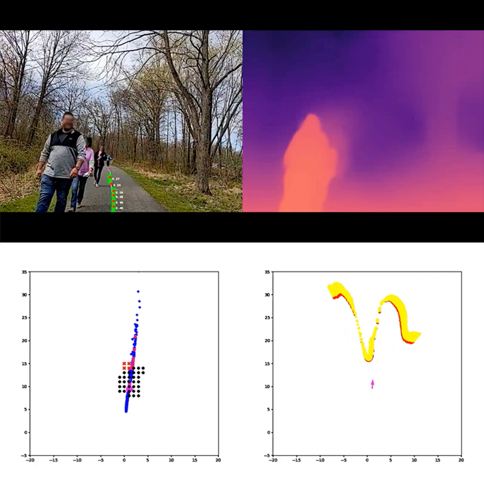

# Project Guideline

Project Guideline is a research project that leverages on-device ML to enable
people who are blind and low-vision to walk or run for exercise independently.
The project aims to help people move freely and independently in the physical
world.

Learn more about the project in our [Blog post][blog-post] and
[Youtube video][youtube-video].

This is not an officially supported Google product.

[blog-post]: https://ai.googleblog.com/2021/05/project-guideline-enabling-those-with.html
[youtube-video]: https://youtu.be/C_h4HnKVptk

## Requirements

1. Pixel 6, Pixel 7, or Pixel 8 Android phone (Android 11+). These devices have
   a TPU (Tensor Processing Unit) which significantly improves ML model
   performance.
2. [Waist harness for phone][harness-docs]
  - Camera should be held around waist height, approximately 1 meter above
    ground
  - Rear camera must be facing forward without obstruction, with a level angle
    pointed roughly toward horizon.
3. Bluetooth headphones
  - Recommended: [Shokz OpenRun][shokz-openrun] or similar which do not block
   ambient sounds
4. A safe pedestrian pathway with a marked line:
  - **Surface:** solid, non-permeable (e.g. asphalt or concrete, not dirt or
    gravel)
  - **Width:** recommended at least 10ft wide, with 5' on either side of
    guideline to safely drift
  - **Existing markings:** minimal, if possible. Must be in a different color
    than the guideline color.
  - **Traffic pattern:** one-way preferred. Two-way traffic possible if the path
   is wide enough (See width criteria above)
  - **Line:** May be permanent (e.g. painted) or temporary (e.g. gaffers tape)
  - **Line width:** 4 inches wide (normal width for road markings)
  - **Line color:** purple, similar to Pantone 265C or RGB(144, 99, 205)
5. A sighted *spotter*:
  - While the technology allows for running without being tethered to another
    person or guide animal,
    a sighted person should remain close to the runner to ensure the runner's
    safety.

[harness-docs]: project_guideline/harness/README.md
[shokz-openrun]: https://shokz.com/products/openrun

# Usage

**IMPORTANT:** The app is a demonstration and can not navigate the runner in all
scenarios or detect all obstacles. It may function incorrectly or not at all.
It is recommended to be used with other forms of assistance, including a sighted
person remaining close to the runner.

1. Ensure devices and environment are set up according to the requirements.
2. Open the *Project Guideline* app on the phone, and place phone in harness.
3. Begin by positioning on the guideline and facing the direction of the path.
3. An initial audio tone will play while the system is initializing. The
   guideline must be visible to the camera to start navigation.
4. Once the system enters a *tracking* state, the audio tones will change to
   navigate the runner along the line. The sound will be emitted from the
   direction of the guideline, and may increase in volume and/or frequency as
   the runner drifts further (laterally or rotationally) from the line.
5. The obstacle detection feature will emit a different sound when an object
   is detected in the path of the runner.
6. If the system loses tracking state or can no longer navigate the runner, a
   "STOP" audio cue is played and the system returns to the initialization
   sequence.


## Build Prerequisites

### Building using Docker image
The included *build.Dockerfile* can be used to create a docker image configured
for building the app.

```shell
$ docker build \
     -t project-guideline/build:latest \
     -f build.Dockerfile \
     https://github.com/google-research/project-guideline.git
```


### Manual build configuration

1. Install Ubuntu 22.04 (amd64).

2. Install required dependencies:

   ```shell
    $ apt update && apt install -y \
        curl \
        wget \
        build-essential \
        openjdk-11-jdk-headless \
        git \
        zip \
        unzip \
        python3 \
        python3-numpy
   ```

3. Install [bazelisk][bazelisk-installation]

   ```shell
   $ wget https://github.com/bazelbuild/bazelisk/releases/download/v1.17.0/bazelisk-linux-amd64
   $ sudo mv bazelisk-linux-amd64 /usr/local/bin/bazelisk
   $ sudo chmod ugo+x /usr/local/bin/bazelisk
   ```

[bazelisk-installation]: https://github.com/bazelbuild/bazelisk#installation

## Building the Android App
These build instructions have been tested on Ubuntu 22.04 (amd64).

1. Start the container (If using Docker)

   It is recommended to mount a local directory to the Docker container to
   persist the code.

   ```shell
   $ LOCAL_DIR=/path/to/development
   $ PROJECT_ROOT=/development
   $ docker run -i -t project-guideline/build:latest -v $LOCAL_DIR:$PROJECT_ROOT/project-guideline
   ```

2. Clone the repo

   ```shell
   $ cd $PROJECT_ROOT
   $ git clone https://github.com/google-research/project-guideline.git
   ```

3. Setup the Android SDK and NDK

   This step is required once before building. If the download/setup fails you
   may need to delete the ~/Android/Sdk and ~/Android/Ndk directories and try
   again.

   ```shell
   $ cd $PROJECT_ROOT/project-guideline
   $ bash ./setup_android_sdk_and_ndk.sh ~/Android/Sdk ~/Android/Ndk r21e --accept-licenses
   ```

3. Build with bazel:

   ```shell
    $ cd $PROJECT_ROOT/project-guideline
    $ bazelisk build --config=android_arm64 \
          --compilation_mode=opt \
          --spawn_strategy=local \
          //project_guideline/android:guideline_app
   ```

   Note that --compilation_mode=opt is required for the system to run at
   maximum performance. For additional debugging information this can be
   replaced with --compilation_mode=fastbuild or --compilation_mode=dbg.

   If using Docker, it is recommended to update the docker image after running
   this step so the dependency cache is saved and will drastically speed up
   future builds. Alternatively, the *--output_user_root* flag can be passed
   to bazelisk to specify a persistent cache location.

   Occasionally a dependency repository will fail to download the first time
   (e.g. *FileNotFoundException*). This can be transient and it is suggested to
   try the build command again.

4. Install to device:

   ```shell
    $ adb install -r bazel-bin/project_guideline/android/guideline_app.apk
   ```

   If using docker, the bazel-bin location is symlinked so it is recommended to
   either copy the apk to a mounted volume accessible on the host first, or use
   the *--output_user_root* bazel flag to specify a host directory.

## Running tests

```shell
$ bazelisk test --spawn_strategy=local \
      --define MEDIAPIPE_DISABLE_GPU=1 \
      --//:gl=swiftshader \
      //project_guideline/...
```

## Simulator

Project Guideline was designed for testability and portability, and includes a
simulator based on Unreal Engine which enables rapid testing and prototyping of
the system in a virtual environment. Everything from the ML models to the audio
feedback system runs natively within an Unreal Engine plugin, giving the full
Project Guideline experience without needing all the hardware and physical
environment set up. See the instructions in the *unreal* directory for more
information.


## System Design

The goal of Project Guideline is to safely and reliably guide a blind runner
along a physically defined path through unpredictable environments, detecting
and alerting the runner of upcoming features such as sharp turns and obstacles.
This is accomplished by tracking the runner's movements and using camera image
perception to build and refine a virtual map of the runner's real world
environment. The system is composed of several components which work together
to provide audio navigational instructions to the runner.



The above image represents the state of the system in action. The top-left is
the camera image frame with detected guideline mask and keypoints overlaid on
the center of the path. The top-right is the ML depth map output for this frame.
The bottom-left is a top-down 2D map of the guideline points which have been
projected into world coordinates and aggregated over multiple frames. The red
dots are keypoints detected for this frame, and blue dots from previous frames.
The black dots represent the *clearance zone* for the occupancy map - the region
in which the user will be alerted of any detected obstacles. The bottom-right
is a top-down view of the point cloud computed from the ML depth map for
potential obstacles within a region above the ground plane.

### ARCore Motion Tracker

The `ArcoreMotionTracker` component uses the
[ARCore SDK for Android NDK][arcore-ndk-ref] to track the pose of the device
camera relative to the world. ARCore is also used to provide camera images
corresponding to these poses along with a point cloud of tracked 3D visual
feature points (these feature points are used for to improve depth detection,
described later).

Using the camera pose, it's possible to project points from 2D image space into
3D world space and determine the position of the runner relative to the
inferred position of the guideline and any detected obstacles.

[arcore-ndk-ref]: https://developers.google.com/ar/reference/c

### Guideline Detector

The `GuidelineDetector` is responsible for running the ML pipeline on the camera
image feed. This uses the MediaPipe Tasks `ImageSegmenter` to run both the
guideline segmentation model and depth model on each camera frame. It converts
the binary guideline segmentation mask into a list of keypoints, and also
outputs a 16-bit depth map.

### Guidance System

The `GuidanceSystem` collects the intermediate outputs for a given camera
frame (camera pose, guideline keypoints, and depth map) and uses these to:

1. Determine the current position and velocity vector of the runner
2. Aggregate the guideline keypoints and run a curve-fitting algorithm to
   determine the estimated position and shape of the guideline in world space.
3. Align the ML depth map with ARCore tracked visual features to improve depth
   accuracy. The depth values in the ML depth map are not always accurate in
   absolute terms, so a RANSAC (random sample consensus) algorithm is used to
   fit the depth map to the tracked 3D visual feature points from ARCore.
3. Update the `OccupancyMap` for any detected obstacles based on the depth map.
4. Use the `ControlSystem` to generate an updated control signal based on the
   current state of the runner relative to the environment.

### Control System

The `ControlSystem` uses the current pose of runner and state of the virtual
map to generate navigational signals. This includes:

1. Detecting the lateral distance of the runner tangentially from the guideline.
2. Finding a *target point* along the line for which to direct the runner, based
   on the runner's current velocity and direction.
3. Computing the rotational movement required to align the runner with the
   upcoming *target point*.
4. Detecting and computing any upcoming turns along the guideline and the
   angle of those turns.
5. Detecting any obstacles in the `OccupancyMap` which may impede the runner
   based on their current trajectory.
6. Determining any *stop* condition (e.g. ARCore tracking lost, or runner
   diverging too far from guideline).

### Audio System

The `AudioSystem` provides audio feedback to the user, indicating system state
and navigation instructions. This was designed to provide low-latency audio
feedback based on the latest `ControlSignal` from the `ControlSystem`.

On Android it uses the [AAudio API][aaudio-api] for high-performance,
low-latency audio through bluetooth headphones. It is also capable of streaming
audio to the Unreal Engine plugin when running in the simulator.

Several *sound packs* are available which have been developed and tested by a
team of sound researchers and engineers at Google. The sounds use a combination 
of panning, pitch, and spatialization to guide the runner along the line. 

The `AudioSystem` begins by playing a musical sequence to alert the runner of
system initialization while ARCore camera tracking and guideline spatialization
are obtained. Next the system will begin playing a sequence of tones and sounds
to guide the runner along the guideline. For example, a runner veering to the
right may hear a beeping sound in the left ear to indicate the line is to the
left, with increasing frequency for a larger course correction.  If the runner
veers further, a high-pitched warning sound may be heard in the right ear to
indicate the edge of the path is approaching. In addition, a clear “stop” audio
cue is present in the event the runner veers too far from the line, an anomaly
is detected, or the system fails to provide a navigational signal.

[aaudio-api]: https://developer.android.com/ndk/guides/audio/aaudio/aaudio

### Visualizations

The user typically relies only on audio feedback and is not viewing the device
screen while using Project Guideline, however it can be useful to visualize the
state of the system for testing and debugging purposes. The *visualization*
directory contains components for rendering the state of the system to the
screen.

The `CameraFeedRenderer` displays the live camera feed images on the screen.

The `EnvironmentMapRenderer` renders a *minimap* in the lower corner of the
screen, displaying the current orientation of the runner, detected guideline
points and features, detected obstacles, and indications of the current
control signals given to the user.

### Logging

The `GuidelineLogger` component is used to record various events and debugging
information throughout the system. These events are defined as protocol buffer
messages (see *proto/guideline_log.proto*).

By default the Android app uses a `NoopGuidelineLogger` which discards log
events, however it can be configured to use `FileGuidelineLogger` to save the
events to a file. This file can be later loaded (e.g. in a
[Colab Notebook][colab]) to debug and analyze the behavior of the system in
detail.

[colab]: https://colab.research.google.com/

### Android App

The core Project Guideline code is implemented in C++ for maximum performance
and close integration with MediaPipe and other low-level libraries. The Android
app runs Project Guideline through a JNI interface layer (see *android/jni*
directory). The core system is referred to as the *Guideline Engine*. It is
configured through the `NativeEngineFragment` which initializes the
`GuidelineEngine`, passes necessary lifecycle events to the native code, and
enables rendering of the visualizations through OpenGL.
