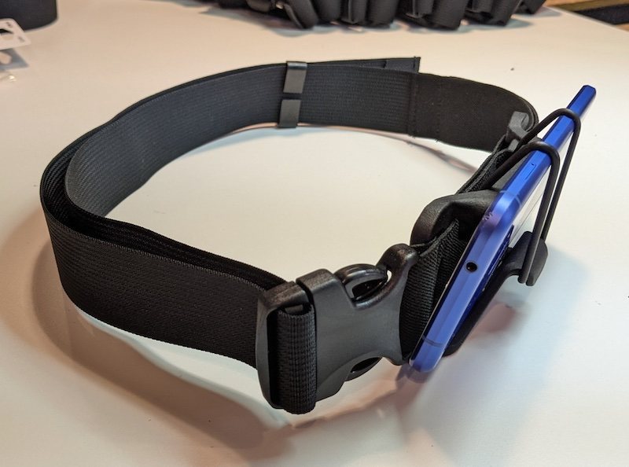
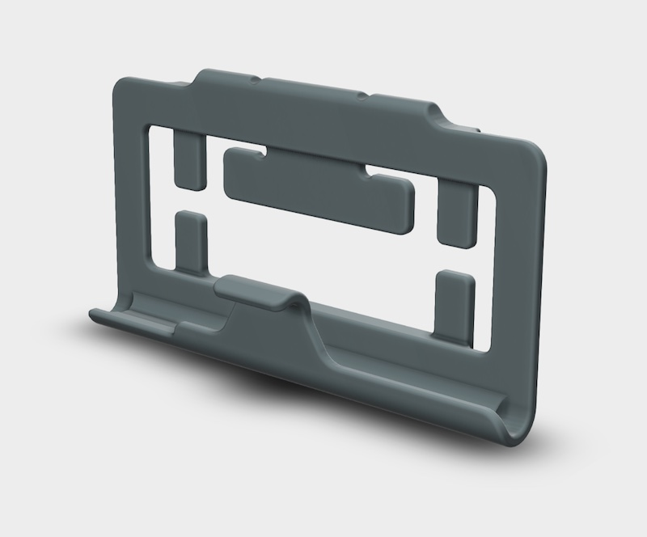
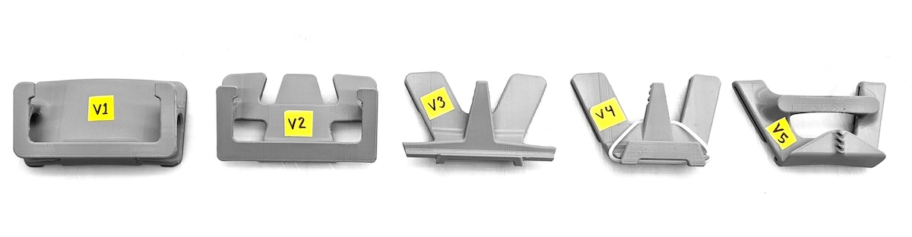
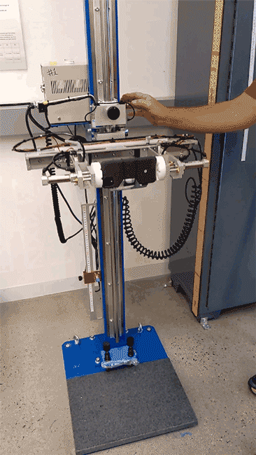

# Project Guideline Harness

A custom harness for Project Guideline was designed to securely hold a
Google Pixel phone around the user's waist at an optimal 15° downward angle.

The files below are provided to create your own Project Guideline harness. The
harness consists of a 3D printed phone mount, a waist belt which is assembled
and sewn, and an O-ring to secure the phone into the mount. Details of the
materials, specifications, and assembly instructions are available in the
Tech-Pack PDF. For the mount we've used an HP 4200 3D printer with Nylon 12
material.

* [3D model STEP file](assets/guideline_phone_harness.stp)
* [3D model STL file](assets/guideline_phone_harness.stl)
* [Tech-Pack Materials and Construction PDF](docs/guideline-harness-techpack.pdf)

The harness was designed by an in-house team through several revisions to
optimize for form, function, and reliability.

In addition, the harness underwent reliability testing including compression
tests, cyclic fatigue tests, and drop tests.

