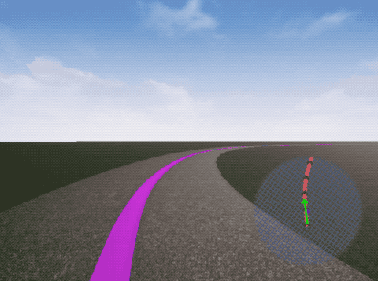
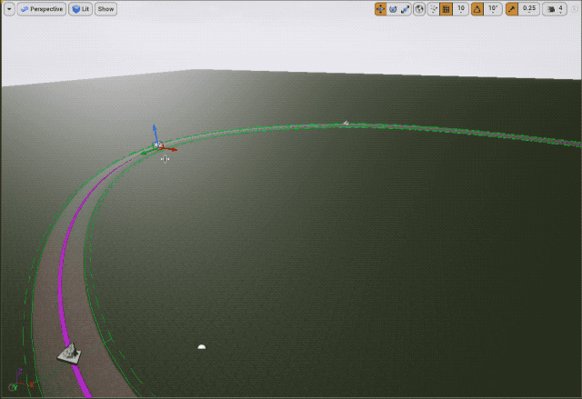
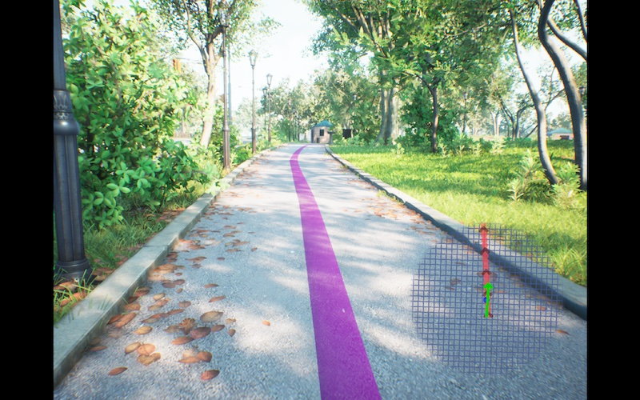

# Project Guideline Unreal Simulator

The Project Guideline Unreal Simulator runs the Guideline code in a virtual
3D environment within Unreal Engine. This allows for rapid development and
testing without requiring an actual outdoor testing location.

The simulator works by compiling the Project Guideline code into a shared
library that interfaces with a custom Unreal Engine plugin. The plugin sends
rendered images to the Project Guideline code (similar to the camera image feed
of an actual device) where the image runs through the normal segmentation
pipeline. While an actual device would use ARCore to perform motion tracking
to get the camera pose, the simulator bypasses this step and insteads sends the
ground-truth camera pose information directly from Unreal. The navigation
instructions are generated and audio feedback is played in Unreal Engine.



The *GuidelineBasic* Unreal project demonstrates a simple virtual environment
which uses a Spline component to render a virtual path with a purple guideline.
The path can easily be modified to test various curvatures and scenarios.



**NOTE:** The simulator currently doesn't fully support obstacle detection. This
will require updating the plugin and *PassthroughMotionTracker* to send a
collection of randomly sampled *TrackingFeature* points for each frame. This
will be added in a future update.

## Building the Simulator

These instructions have been tested on Ubuntu 22.04. While it is possible to
build and run on other platforms including Windows and Mac, the Project
Guideline bazel build system is currently only configured for building on
Linux.

1. Follow the Unreal Engine [Linux Quick Start][unreal-linux-quick-start]
   instructions to build Unreal Engine 4.27.

   Download the [Unreal Engine 4.27.2-release][unreal-4.27.2-release] and be
   sure to follow the instructions on that page to update the
   *Commit.gitdeps.xml* file before running the setup scripts.

2. Install [bazelisk][bazelisk-installation]

   ```shell
   $ wget https://github.com/bazelbuild/bazelisk/releases/download/v1.17.0/bazelisk-linux-amd64
   $ sudo mv bazelisk-linux-amd64 /usr/local/bin/bazelisk
   $ sudo chmod ugo+x /usr/local/bin/bazelisk
   ```

3. Install required dependencies:

   ```shell
    $ apt install -y \
        curl \
        wget \
        build-essential \
        openjdk-11-jdk-headless \
        zip \
        unzip \
        python3 \
        python3-numpy \
        libegl-dev \
        libgles-dev
   ```

4. Compile the shared library:

   ```shell
    $ bazelisk build \
          --compilation_mode=opt \
          --spawn_strategy=local \
          //project_guideline/unreal:libguideline_engine_unreal.so
   ```

5. Copy the shared library and header file to plugin directory:

   ```shell
   $ cp bazel-bin/project_guideline/unreal/libguideline_engine_unreal.so \
         project_guideline/unreal/projects/GuidelineBasic/Plugins/GuidelineEngine/Source/GuidelineEngine/lib/
   $ cp project_guideline/unreal/unreal_plugin.h \
     project_guideline/unreal/projects/GuidelineBasic/Plugins/GuidelineEngine/Source/GuidelineEngine/Private/guideline_unreal_plugin.h
   ```

6. Build the *GuidelineBasic* Unreal project from command-line. This is required
   before the project can be opened in the UE4Editor.

   ```shell
   $ UE4_ROOT=/path/to/UnrealEngine-4.27.2-release
   $ UPROJECT_DIR=/path/to/project_guideline/unreal/projects/GuidelineBasic
   $ UPROJECT=$UPROJECT_DIR/GuidelineBasic.uproject

   $ UE4_ROOT/GenerateProjectFiles.sh -project="$UPROJECT" -game="GuidelineBasic"
   $ cd $UPROJECT_DIR
   $ make GuidelineBasicEditor
   ```

7. Launch UE4Editor (from
   UnrealEngine-4.27.2-release/Engine/Binaries/Linux/UE4Editor) and open the
   GuidelineBasic.uproject file.

   Select *Build Lighting Only* from the Build Options menu and wait for
   lighting to be built.

8. Press *Play* button to run the simulator. Or select 
    *File -> Package Project -> Linux -> Linux* to build a binary.

[bazelisk-installation]: https://github.com/bazelbuild/bazelisk#installation
[unreal-linux-quick-start]: https://docs.unrealengine.com/4.27/en-US/SharingAndReleasing/Linux/BeginnerLinuxDeveloper/SettingUpAnUnrealWorkflow/
[unreal-4.27.2-release]: https://github.com/EpicGames/UnrealEngine/releases/tag/4.27.2-release

## Using the Simulator

1. Launch the simulator through Unreal Editor or standalone compiled binary.

2. Use the mouse change orientation, *W* key to move forward, and *S* key to
   move backwards. The *A* and *D* keys can be used to strife left/right,
   however this can result in an unnatural movement so it is recommended to
   use only the mouse and forward key to navigate.

3. Press the *ESC* key to exit the simulator.

## Realistic Simulation

The included Unreal project is simple example with only a basic path and
geometry. It's possible to build upon the project or copy the plugin from
*Plugins/GuidelineEngine* to another project with a more detailed and realistic
environment, adding obstacles and other features.

The [City Park Environment Collection LITE][city-park-lite] is available for
free on the Unreal Engine Marketplace, and contains a large outdoor park scene
with many reusable assets. This is an ideal environment for Project Guideline,
and the project can easily be modified to include a purple line along the paths 
and integrate with the plugin.



[city-park-lite]: https://www.unrealengine.com/marketplace/en-US/product/city-park-environment-collection-lite


